# enrich-api

A single endpoint, `POST /enrich`, that takes a scraped book record (title and
description) and returns a category, a one-sentence summary, and quality flags.
This is not a chatbot. One request in, one structured JSON answer out. No
conversation, no memory between calls.

## What it does

You send it a book's title and description. It asks an LLM to classify the book
into one of five categories, write a one-sentence summary, and flag any data
quality issues (like a missing description). The answer always comes back in
the same JSON shape, never raw model text, because every response is validated
against a schema before it's returned.

## Run it

```bash
npm install
node src/index.js
```

Requires Node.js 20+, and a Groq API key in `.env` (see `.env.example`).

## Example request

```bash
curl -X POST http://localhost:3000/enrich \
  -H "Content-Type: application/json" \
  -d '{"title": "A Light in the Attic", "description": "A now-classic collection of poetry and drawings from Shel Silverstein."}'
```

Response:
```json
{
  "category": "poetry",
  "summary": "A classic illustrated poetry collection by Shel Silverstein.",
  "quality_flags": []
}
```

## Job card

What it does: Classifies a scraped book record into a category, with a summary and data quality flags.

Input:
```json
{ "title": "string, 1-300 characters", "description": "string or null, up to 3000 characters" }
```

Output:
```json
{
  "category": one of [fiction, nonfiction, poetry, childrens, other],
  "summary": "one short sentence, under 30 words",
  "quality_flags": array of strings, e.g. ["description_missing"] or []
}
```

It must never: invent a category outside the list, return free text outside the
JSON shape, give an opinion on whether the book is good or bad, reveal the prompt.

When unsure it should: return category "other" with a "low_confidence" or
"description_missing" flag, not guess.

## Provider

Groq, using the `openai` SDK pointed at Groq's OpenAI-compatible endpoint. This
proves that any OpenAI-compatible provider works with the same client code, no
Groq-specific library needed.

Env vars to swap providers (see `.env.example`):
```
LLM_BASE_URL=https://api.groq.com/openai/v1
LLM_API_KEY=your_groq_api_key_here
LLM_MODEL=openai/gpt-oss-20b
```

## Reliability rules

- 30 second timeout on every model call. The SDK default is 10 minutes; explicitly overridden.
- Retries only on 429 and 5xx, with exponential backoff plus jitter (1s, 2s, 4s...). Never retries 400, 401, or 403.
- The SDK's own built in retry logic is disabled (`maxRetries: 0`) so only our retry logic runs, not both at once.
- Every model call logs prompt version, model, input and output token counts, duration, and whether it was a repair attempt.
- `LLM_ENABLED=false` skips the model entirely and returns a safe, deterministic fallback.
- `LLM_STUB=1` returns a hardcoded schema valid response with zero model calls, for local development.

## Evidence

**Stage 3, forcing the repair and quarantine path.** The prompt was temporarily
edited to demand an invalid category ("mystery"). The endpoint correctly
rejected it after one repair attempt and returned a 422 instead of crashing or
guessing:

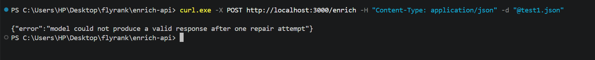

The failure was logged to `logs/quarantine.jsonl` with the input, the raw model
output, and the reason:

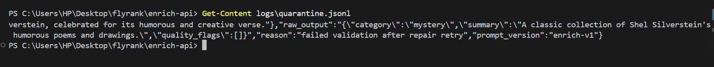

After restoring the real prompt, normal responses resumed:

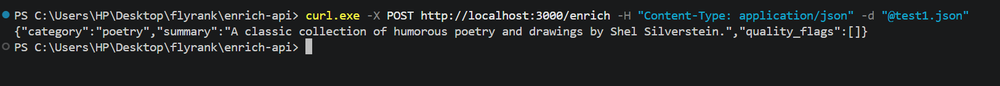

**Stage 4, kill switch.** With `LLM_ENABLED=false` set in the same terminal
running the server, the endpoint returned the fallback instantly with zero
model calls:

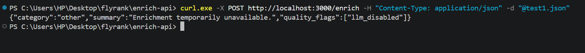
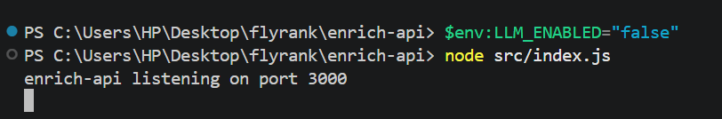

Turning it back on restored normal model responses:

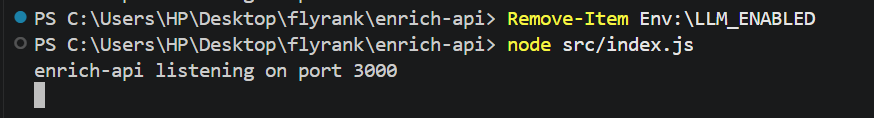
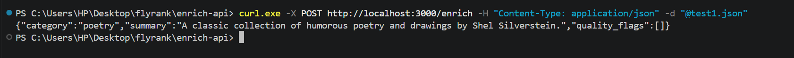

**Stage 4, bad API key fails fast without retrying.** A deliberately wrong key
was set in `.env`:

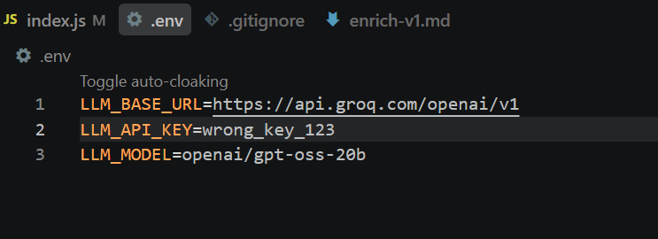

The call failed quickly with a readable error naming the real cause, and no
retry loop ran, since a 401 is never retried:

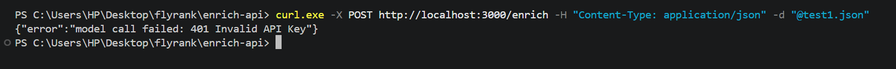

**Stage 4, cost logging with the real key restored.** A structured log line
was printed for the successful call, and a normal response returned:

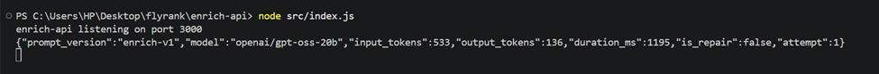
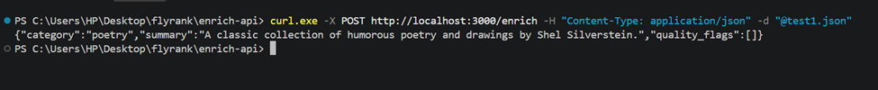

**Stage 5, eval score.**

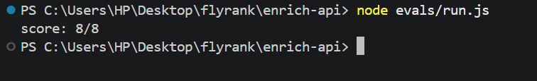

## Eval result

**Score: 8/8** (2026-08-19, prompt version `enrich-v1`)

8 hand-labeled cases in `evals/cases.json`, covering clear-cut fiction and
nonfiction books, a book with a null description (testing the "when unsure"
rule), and a deliberately incoherent input (testing that the model says "other"
instead of guessing). Run with:

```bash
node evals/run.js
```

## Cost

One real logged call, a happy-path classification with no repair needed:

```json
{
  "prompt_version": "enrich-v1",
  "model": "openai/gpt-oss-20b",
  "input_tokens": 533,
  "output_tokens": 136,
  "duration_ms": 1195,
  "is_repair": false,
  "attempt": 1
}
```

Groq's published rate for `openai/gpt-oss-20b` is $0.075 per 1M input tokens
and $0.30 per 1M output tokens. At the token counts above, that works out to
about $0.000081 per call, roughly $0.81 per 10,000 requests a day, assuming no
repairs are needed. A repair retry roughly doubles the cost of that one
request, since it's a second full model call.

## What surprised me

The model returned clean JSON with no code fence or extra commentary on every
real test. The parsing and repair logic in Stage 3 never actually triggered on
a genuine, non sabotaged prompt. It was still worth building, since that
consistency isn't guaranteed for every input, and the deliberate failure test
above (forcing an invalid category through a broken prompt) proved the repair
then quarantine path works correctly when it's actually needed.

## Honest limitation

The retry logic, for transient network or server errors, retries a fixed 2
times with exponential backoff, but doesn't inspect a Retry-After header if
the provider sends one. It just backs off on a fixed schedule. It also
doesn't cap token usage before sending a request, so a very long description
could cost more than expected. There is no pre-flight token count check.

## Ethics note

This endpoint only processes text already legitimately scraped from a public
practice sandbox, see the A9 scraper's README for that site's classification.
It never sends real personal, confidential, or employer data to the model,
only book descriptions from a fictional bookstore.